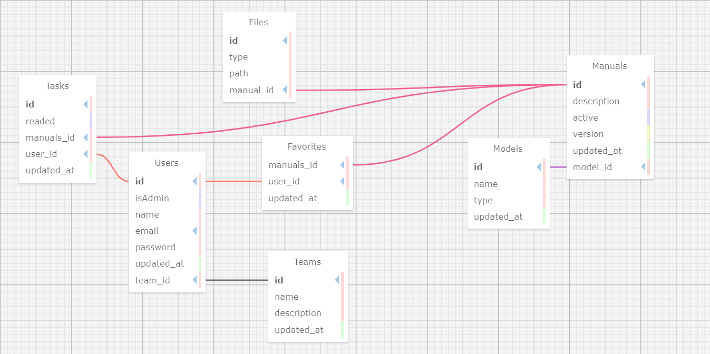

<br>

No desenho acima, tem-se o banco de dados da aplicação com 7 tabelas, sendo elas: User, Teams, Models, Manuals, Tasks, Files e Favorites. Começando pela tabela de Teams, ela tem quatro atributos: id, name, description e updated_at. O primeiro atributo, id, é do tipo inteiro, sendo uma chave primária na tabela, ou seja, o valor não pode se repetir. O segundo atributo, name, é do tipo string, sendo o nome do time. O terceiro atributo, description, é do tipo string, sendo a descrição do time. O quarto atributo, updated_at, é do tipo datetime, sendo a data de atualização daquele dado na tabela. <br><br>
A tabela de User tem cinco atributos: id, isAdmin, name, email, password, updated_at e team_id. O primeiro atributo, id, é do tipo inteiro, sendo uma chave primária na tabela, ou seja, o valor não pode se repetir. O segundo atributo, isAdmin, é do tipo boolean, sendo um valor que indica se o usuário é administrador ou não. O terceiro atributo, name, é do tipo string, sendo o nome do usuário. O quarto atributo, email, é do tipo string, sendo o email do usuário. O quinto atributo, password, é do tipo string, sendo a senha do usuário. O sexto atributo, updated_at, é do tipo datetime, sendo a data de atualização daquele dado na tabela. O sétimo atributo, team_id, é do tipo inteiro, sendo uma chave estrangeira que referencia a tabela de Teams. <br><br>

A tabela de Models tem quatro atributos: id, name, type e updated_at. O primeiro atributo, id, é do tipo inteiro, sendo uma chave primária na tabela, ou seja, o valor não pode se repetir. O segundo atributo, name, é do tipo string, sendo o nome do modelo. O terceiro atributo, type, é do tipo string, sendo o tipo do modelo. O quarto atributo, updated_at, é do tipo datetime, sendo a data de atualização daquele dado na tabela. <br><br>

Por sua vez, a tabela de Manuals tem seis atributos: id, description, active, version, updated_at e model_id. O primeiro atributo, id, é do tipo inteiro, sendo uma chave primária na tabela, ou seja, o valor não pode se repetir. O segundo atributo, description, é do tipo string, sendo a descrição do manual. O terceiro atributo, active, é do tipo boolean, sendo um valor que indica se o manual está ativo ou não. O quarto atributo, version, é do tipo inteiro, sendo a versão do manual. O quinto atributo, updated_at, é do tipo datetime, sendo a data de atualização daquele dado na tabela. O sexto atributo, model_id, é do tipo inteiro, sendo uma chave estrangeira que referencia a tabela de Models. <br><br>

Já a tabela de Files tem quatro atributos também, sendo eles: id, type, path e manual_id. O primeiro atributo, id, é do tipo inteiro, sendo uma chave primária na tabela, ou seja, o valor não pode se repetir. O segundo atributo, type, é do tipo string, sendo o tipo do arquivo. O terceiro atributo, path, é do tipo string, sendo o caminho do arquivo. O quarto atributo, manual_id, é do tipo inteiro, sendo uma chave estrangeira que referencia a tabela de Manuals. <br><br>

Logo em seguida, temos a tabela de Tasks com cinco atributos: id, readed, user_id, updated_at e manuals_id. O primeiro atributo, id, é do tipo inteiro, sendo uma chave primária na tabela, ou seja, o valor não pode se repetir. O segundo atributo, readed, é do tipo boolean, sendo um valor que indica se a tarefa foi lida ou não. O terceiro atributo, user_id, é do tipo inteiro, sendo uma chave estrangeira que referencia a tabela de User. O quarto atributo, updated_at, é do tipo datetime, sendo a data de atualização daquele dado na tabela. O quinto atributo, manuals_id, é do tipo inteiro, sendo uma chave estrangeira que referencia a tabela de Manuals. <br><br>

Por fim, a tabela Favorites, que contem somente três atributos: manual_id, user_id e updated_at. O primeiro atributo, manual_id, é do tipo inteiro, sendo uma chave estrangeira que referencia a tabela de Manuals. O segundo atributo, user_id, é do tipo inteiro, sendo uma chave estrangeira que referencia a tabela de User. O terceiro atributo, updated_at, é do tipo datetime, sendo a data de atualização daquele dado na tabela. <br><br>

Aprofundando nos relacionamentos, entre a tabela Teams e Users, existe uma relação 1:N. Um time pode ter muitos usuários e um usuário pode participar de um time. Olhando para o relacionamento entre as tabelas de Users, Favorites e Manuals, ela tem uma relação 1:N e 1:N, ou seja, um usuário pode conter vários favoritos e cada favorito, contem um manual como favorito. Entre Models e Manuals, também existe uma relação 1:N, um modelo (notebook, computador, servidor X) pode ter vários manuais, essa tabela foi criada para auxiliar no versionamento requisitado pelo parceiro. Da mesma forma, entre Manuals e Files é uma relação 1:N, isto é, um manual pode conter vários arquivos e um arquivo pertence à um manual. Por fim, Users, Tasks e Manuals, possuem uma relação 1:N (Users e Tasks) e N:1(Tasks e Manuals), respectivamente. Cada usuário pode ter várias tarefas, mas uma tarefa pertence à um usuário. Do mesmo modo, um manual tem várias tarefas, mas uma tarefa pertence à um manual.<br><br>

````
CREATE TABLE Teams (
    id SERIAL PRIMARY KEY,
    name VARCHAR NOT NULL,
    description VARCHAR,
    updated_at TIMESTAMP DEFAULT CURRENT_TIMESTAMP
);

CREATE TABLE Users (
    id SERIAL PRIMARY KEY,
    isAdmin BOOLEAN NOT NULL,
    name VARCHAR(50) NOT NULL,
    email VARCHAR NOT NULL UNIQUE,
    password VARCHAR NOT NULL,
    updated_at TIMESTAMP DEFAULT CURRENT_TIMESTAMP,
    team_id INTEGER REFERENCES Teams(id) NOT NULL
);


CREATE TABLE Models (
    id SERIAL PRIMARY KEY,
    name VARCHAR NOT NULL,
    type VARCHAR,
    updated_at TIMESTAMP DEFAULT CURRENT_TIMESTAMP
);

CREATE TABLE Manuals (
    id SERIAL PRIMARY KEY,
    description VARCHAR NOT NULL,
    active BOOLEAN DEFAULT TRUE,
    version INTEGER,
    model_id INTEGER REFERENCES Models(id) NOT NULL,
    updated_at TIMESTAMP DEFAULT CURRENT_TIMESTAMP
);


CREATE TABLE Files (
    id SERIAL PRIMARY KEY,
    type VARCHAR,
    path VARCHAR NOT NULL,
    manual_id INTEGER REFERENCES Manuals(id) NOT NULL,
    updated_at TIMESTAMP
);

CREATE TABLE Tasks (
    id SERIAL PRIMARY KEY,
    readed BOOLEAN DEFAULT FALSE,
    user_id INTEGER REFERENCES Users(id) NOT NULL,
    updated_at TIMESTAMP DEFAULT CURRENT_TIMESTAMP,
    manuals_id INTEGER REFERENCES Manuals(id) NOT NULL
);

CREATE TABLE Favorites (
    manuals_id INTEGER REFERENCES Manuals(id) NOT NULL,
    user_id INTEGER REFERENCES Users(id) NOT NULL,
    updated_at TIMESTAMP
);
````
<br><br>
Acima, está o código SQL para a criação dessas tabelas em uma `database`. Além disso, na pasta `assets` contem o XML dessa base de dados e um arquivo txt com o código para a criação das tabelas.